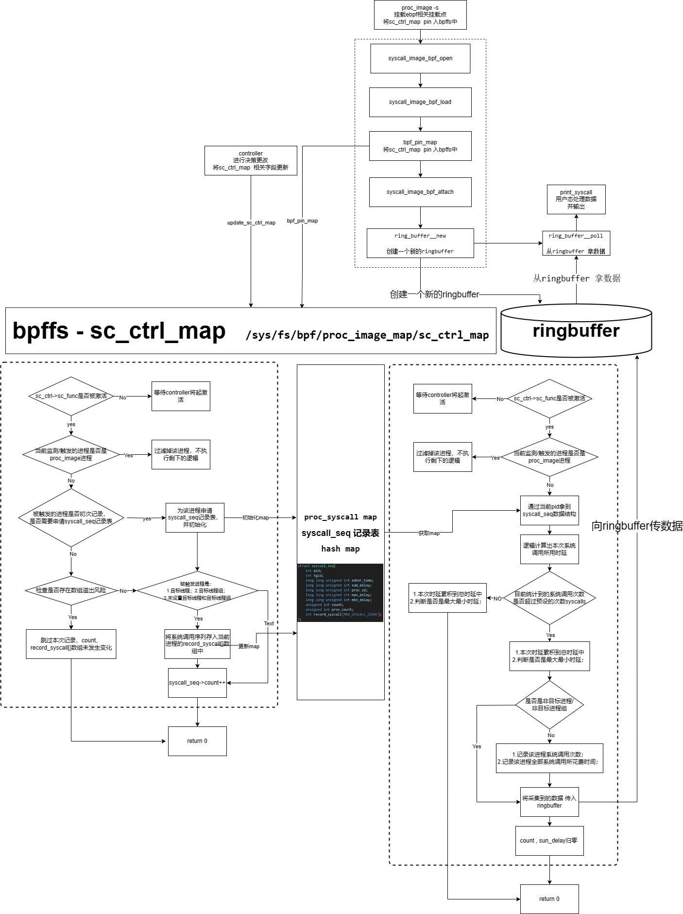

# Syscall_image工具使用说明:

syscall_image工具是用于监测系统中系统调用时延的工具, 该工具可以监测特定线程或线程组调用系统调用情况，统计输出该线程系统调用时延（系统调用平均时延、系统调用最大时延、系统调用最大时延），并将系统调用序列号顺序输出，可用于解决进程出现异常后的问题排查；

## 1.代码逻辑图：



## 2.使用方法：

### 2.1.编译

首先在`lmp/eBPF_Supermarket/CPU_Subsystem/eBPF_proc_image`目录下进行编译操作；

```shell
sudo make
```

编译成功后，会生成两个可执行文件`proc_image`,`controller`, 后面的数据监测均围绕这两个可执行文件；

### 2.2.挂载

在`lmp/eBPF_Supermarket/CPU_Subsystem/eBPF_proc_image`目录下运行 `proc_image`可执行文件，

通过`proc_image -h`命令可查看进程画像的使用方法:

```shell
xhb@1:~/lmp/eBPF_Supermarket/CPU_Subsystem/eBPF_proc_image$ sudo ./proc_image -h
Usage: proc_image [OPTION...]
Trace process to get process image.

  -a, --all                  Attach all eBPF functions(but do not start)
  -k, --keytime              Attach eBPF functions about keytime(but do not
                             start)
  -l, --lock                 Attach eBPF functions about lock(but do not start)
                            
  -r, --resource             Attach eBPF functions about resource usage(but do
                             not start)
  -s, --syscall              Attach eBPF functions about syscall sequence(but
                             do not start)
  -S, --schedule             Attach eBPF functions about schedule (but do not
                             start)
  -?, --help                 Give this help list
      --usage                Give a short usage message
```

挂载syscall_image工具相关挂载点；

```shell
sudo ./proc_image -s
```

```shell
xhb@1:~/lmp/eBPF_Supermarket/CPU_Subsystem/eBPF_proc_image$ sudo ./proc_image -s
libbpf: loading object 'syscall_image_bpf' from buffer
libbpf: elf: section(2) .symtab, size 1128, link 1, flags 0, type=2
libbpf: elf: section(3) tracepoint/raw_syscalls/sys_enter, size 1064, link 0, flags 6, type=1
libbpf: sec 'tracepoint/raw_syscalls/sys_enter': found program 'sys_enter' at insn offset 0 (0 bytes), code size 133 insns (1064 bytes)
libbpf: elf: section(4) tracepoint/raw_syscalls/sys_exit, size 1216, link 0, flags 6, type=1
....
libbpf: prog 'sched_process_exit': relo #0: <byte_off> [51] struct task_struct.pid (0:85 @ offset 2456)
libbpf: prog 'sched_process_exit': relo #0: matching candidate #0 <byte_off> [80] struct task_struct.pid (0:85 @ offset 2456)
libbpf: prog 'sched_process_exit': relo #0: patched insn #9 (ALU/ALU64) imm 2456 -> 2456
libbpf: unpinned map 'interrupt_ctrl_map' from '/sys/fs/bpf/proc_image_map/interrupt_ctrl_map'
libbpf: pinned map '/sys/fs/bpf/proc_image_map/interrupt_ctrl_map'


```

### 2.3.控制策略：

可使用`controller`工具进行策略控制，策略切换。

重启一个终端, 在`lmp/eBPF_Supermarket/CPU_Subsystem/eBPF_proc_image`目录下运行 `controller`可执行文件。

通过`controller -h`命令可查看进程画像策略切换方法:

```shell
xhb@1:~/lmp/eBPF_Supermarket/CPU_Subsystem/eBPF_proc_image$ sudo ./controller -h 
Usage: controller [OPTION...]
Trace process to get process image.

  -a, --activate             Set startup policy of proc_image tool
  -c, --cpuid=CPUID          Set For Tracing  per-CPU Process(other processes
                             don't need to set this parameter)
  -d, --deactivate           Initialize to the original deactivated state
  -f, --finish               Finish to run eBPF tool
  -k, --keytime=KEYTIME      Collects keytime information about
                             processes(0:except CPU kt_info,1:all kt_info,any 0
                             or 1 when deactivated)
  -l, --lock                 Collects lock information about processes
  -m, --myproc               Trace the process of the tool itself (not tracked
                             by default)
  -p, --pid=PID              Process ID to trace
  -P, --tgid=TGID            Thread group to trace
  -r, --resource             Collects resource usage information about
                             processes
  -s, --syscall=SYSCALLS     Collects syscall sequence (1~50) information about
                             processes(any 1~50 when deactivated)
  -S, --schedule             Collects schedule information about processes
                             (trace tool process)
  -t, --time=TIME-SEC        Max Running Time(0 for infinite)
  -?, --help                 Give this help list
      --usage                Give a short usage message

Mandatory or optional arguments to long options are also mandatory or optional
for any corresponding short options.
```

使用syscall_image工具的不同参数，控制该工具的使用策略：

| 参数 |                                                              |
| ---- | ------------------------------------------------------------ |
| -s   | syscall_image工具  后加参数(syscalls)用于控制每次输出系统调用次数；例：-s 10; |
| -a   | 激活 syscall_image工具；                                     |
| -p   | 指定目标线程；                                               |
| -P   | 指定目标线程组；                                             |
| -c   | 指定检测cpu；                                                |
| -t   | 指定检测时间；                                               |

通过以下指令更改控制策略：

* 激活对线程1111的系统调用进行监测;

	```shell
	sudo ./controller -s 10 -p 1111 -c 0 -a
	```

* 激活对线程组1111的系统调用进行监测;

	```shell
	sudo ./controller -s 10 -P 1111 -c 0 -a
	```

* 关闭对线程1111的系统调用进行监测;

	```shell
	sudo ./controller -s 10 -p 1111 -c 0 -d
	```

* 关闭对线程1111的系统调用进行监测;

	```shell
	sudo ./controller -s 10 -P 1111 -c 0 -d
	```

* 关闭进程画像：

	```shell
	sudo ./controller -f
	```

### 2.3.数据监测：

当更改了使用策略后，将对数据进行检测：


